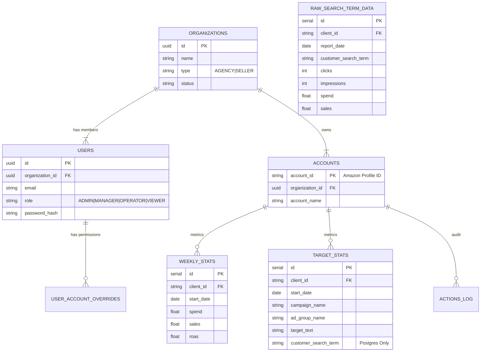

# Backend Architecture & Database Schema

## Overview
The **Saddle** desktop application utilizes a **Dual-Mode Backend** strategy designed for both local efficiency and cloud scalability.

- **Frontend**: Streamlit (Python)
- **Backend Logic**: Python (`core/*`, `features/*`)
- **Database**: 
  - **Local**: SQLite (`db_manager.py`)
  - **Cloud/Production**: PostgreSQL (`postgres_manager.py`)

## Database Strategy

The system automatically selects the database backend based on the environment:

| Feature | SQLite (Local/Test) | PostgreSQL (Cloud/Production) |
| :--- | :--- | :--- |
| **Manager Class** | `DatabaseManager` | `PostgresManager` |
| **Connection** | Direct File Access | Threaded Connection Pool (`psycopg2`) |
| **Auth Schema** | Basic (Users) | **V2 Full** (Users, Orgs, Overrides) |
| **Data Retention** | Aggregated Only (Weekly/Target) | **Raw + Aggregated** (Daily Raw + Weekly) |
| **Upsert Logic** | `INSERT OR REPLACE` | `INSERT ... ON CONFLICT DO UPDATE` |

---

## Entity-Relationship Diagram (ERD)

---

## Core Schemas

### 1. Authentication & Multi-Tenancy (Auth V2)
Located in `core/auth/service.py` & `core/postgres_manager.py`.

*   **`organizations`**: Top-level tenant. Controls subscription limits and billing.
*   **`users`**: System users. Linked to a single Organization.
    *   `role`: Global role (e.g., ADMIN).
*   **`user_account_overrides`**: Granular permission exceptions.
    *   Allows a user to have `OPERATOR` access on specific Amazon Accounts even if their global role is `VIEWER`.
*   **`accounts`**: Amazon Advertising profiles (Brand/Entity) linked to an Organization.

### 2. Performance Data Layer
Located in `core/db_manager.py` (SQLite) & `core/postgres_manager.py` (Postgres).

*   **`weekly_stats`**: High-level aggregation (WoW comparison).
    *   **Granularity**: Client + ISO Week.
    *   **Use Case**: Dashboard impact charts ("Decision Impact").
*   **`target_stats`**: Keyword-level performance.
    *   **Granularity**: Client + Week + Campaign + AdGroup + Target.
    *   **Use Case**: Optimizer analysis, bid recommendations.
*   **`raw_search_term_data`** (Postgres Only):
    *   **Granularity**: Daily + Search Term.
    *   **Purpose**: Allows re-aggregation if improved logic is deployed. SQLite version drops this data after aggregation to save space.

### 3. Operational & Audit
*   **`actions_log`**: Immutable record of all Optimization actions taken.
    *   Tracks `old_value` and `new_value` for every bid change or harvest.
*   **`account_health_metrics`**: Cached latest health scores (ROAS Score, Efficiency Score) to speed up Dashboard rendering.

---

## Data Flow Architecture

### 1. Data Ingestion (Search Term Reports)
1.  **User Upload**: Uploads `.xlsx` via Data Hub.
2.  **Processing**: `DataHub` parses file using `pandas`.
3.  **Tier 1 Storage (Postgres Only)**:
    *   Data is saved to `raw_search_term_data` (Daily granularity).
    *   Uses `ON CONFLICT` to handle re-uploads idempotentLy.
4.  **Tier 2 Aggregation**:
    *   Data is aggregated by **ISO Week**.
    *   Saved to `target_stats` (Performance Hub source).
    *   Saved to `weekly_stats` (Executive Dashboard source).

### 2. Login & Session Management
1.  **Credential Check**: `AuthService.sign_in` checks `users` table.
2.  **Session Hydration**:
    *   User object loaded into `st.session_state['user']`.
    *   Account Overrides loaded into user object.
3.  **Organization Context**:
    *   `get_all_accounts(org_id)` filters visible accounts.

## Critical Implementation Notes

> [!IMPORTANT]
> **Postgres vs SQLite Compatibility**
> When editing SQL queries, always use the `db_manager.placeholder` property.
> - SQLite uses `?`
> - Postgres uses `%s`
> 
> **Do not hardcode placeholders.**

> [!WARNING]
> **Context Managers in SQLite**
> `sqlite3.Cursor` does **not** support context managers (`with cursor:`).
> You must use `try...finally cursor.close()` logic or the wrapper `_get_connection()` provided in `DatabaseManager`.
> Postgres `psycopg2` **does** support cursor context managers.

## Connection Management

*   **SQLite**: Opens a file handle for each request. Wraps in a thread-safe lock implicitly via Streamlit's execution model, but explicit `transaction` handling is recommended.
*   **Postgres**: Uses `psycopg2.pool.ThreadedConnectionPool`.
    *   **Health Check**: Every connection checkout runs `SELECT 1` to ensure vitality.
    *   **Retry Logic**: Decorator `retry_on_connection_error` handles transient network failures (e.g., during deployment or cold starts).
